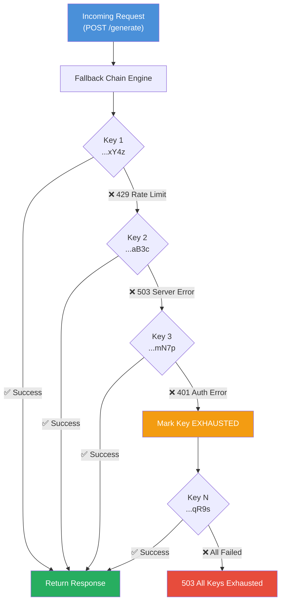
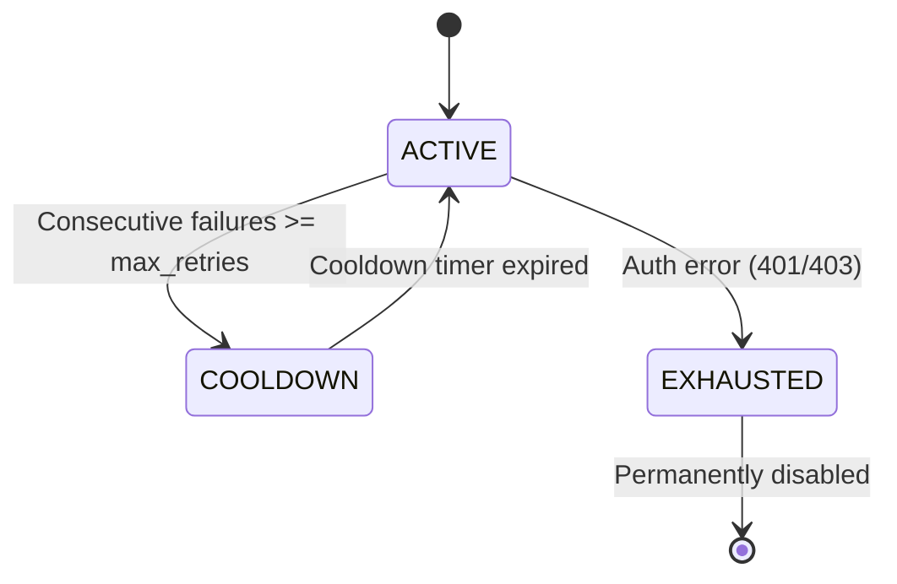

# 🔗 Gemini Multilayer Fallback Chain Service

A **production-grade Python backend service** that provides automatic API key rotation and fallback for Google Gemini. When one API key fails (rate limit, quota exhausted, auth error, timeout, server error), it **seamlessly falls back to the next available key** — zero downtime, zero manual intervention.

---

## Architecture



### Key Lifecycle



| State | Description |
|:------|:-----------|
| **ACTIVE** | Ready to handle requests |
| **COOLDOWN** | Temporarily disabled, auto-recovers after `KEY_COOLDOWN_SECONDS` |
| **EXHAUSTED** | Permanently disabled (invalid/revoked key) |

---

## Quick Start

### 1. Install Dependencies

```bash
cd gemini-fallback-service
pip install -r requirements.txt
```

### 2. Configure API Keys

```bash
# Copy the example env file
cp .env.example .env

# Edit .env and add your Gemini API keys (comma-separated)
# GEMINI_API_KEYS=AIzaSy..._key1,AIzaSy..._key2,AIzaSy..._key3
```

### 3. Run the Server

```bash
python main.py
```

Server starts at `http://localhost:8000` with auto-reload enabled.

### 4. Test It

```bash
# Run the built-in test suite
python test_chain.py

# Or hit the API directly
curl -X POST http://localhost:8000/generate \
  -H "Content-Type: application/json" \
  -d '{"prompt": "What is the capital of France?"}'
```

---

## Configuration

All configuration is via environment variables (`.env` file):

| Variable | Default | Description |
|:---------|:--------|:------------|
| `GEMINI_API_KEYS` | *(required)* | Comma-separated list of Gemini API keys |
| `GEMINI_DEFAULT_MODEL` | `gemini-2.0-flash` | Default model for all requests |
| `MAX_RETRIES_PER_KEY` | `2` | Consecutive failures before cooldown |
| `KEY_COOLDOWN_SECONDS` | `60` | How long a failed key stays in cooldown |
| `REQUEST_TIMEOUT_MS` | `30000` | Request timeout in milliseconds |
| `HOST` | `0.0.0.0` | Server bind address |
| `PORT` | `8000` | Server port |

---

## API Reference

### `POST /generate` — Generate Content

Generate text with automatic key fallback.

**Request:**
```json
{
  "prompt": "Explain quantum computing in simple terms",
  "model": "gemini-2.0-flash",
  "system_instruction": "You are a helpful teacher",
  "temperature": 0.7,
  "max_output_tokens": 500,
  "top_p": 0.9,
  "top_k": 40
}
```

**Response (200):**
```json
{
  "text": "Quantum computing uses quantum bits...",
  "model": "gemini-2.0-flash",
  "key_used": "...xY4z",
  "attempts": 1,
  "latency_ms": 1234.56,
  "finish_reason": "STOP",
  "usage": {
    "prompt_tokens": 12,
    "completion_tokens": 87,
    "total_tokens": 99
  }
}
```

**Error (503 — All Keys Exhausted):**
```json
{
  "detail": {
    "error": "All 3 API keys failed after 6 attempts (4521ms)",
    "attempts": 6,
    "errors_log": [
      {"key": "...xY4z", "error": "ClientError: 429 ...", "permanent": false},
      {"key": "...aB3c", "error": "ClientError: 401 ...", "permanent": true}
    ],
    "latency_ms": 4521.23
  }
}
```

---

### `POST /generate/stream` — Stream Content (SSE)

Stream generated content via Server-Sent Events.

**Request:** Same as `/generate`.

**Response (SSE stream):**
```
data: {"text": "Quantum ", "key_used": "...xY4z", "chunk_index": 1, "is_final": false}

data: {"text": "computing ", "key_used": "...xY4z", "chunk_index": 2, "is_final": false}

data: {"text": "", "key_used": "...xY4z", "chunk_index": 3, "is_final": true, "total_chunks": 2}
```

---

### `GET /health` — Health Dashboard

Monitor the status of all API keys.

**Response:**
```json
{
  "status": "healthy",
  "total_keys": 3,
  "active_keys": 2,
  "default_model": "gemini-2.0-flash",
  "keys": [
    {
      "index": 0,
      "masked_key": "...xY4z",
      "status": "active",
      "consecutive_failures": 0,
      "total_requests": 42,
      "total_successes": 42,
      "total_failures": 0,
      "success_rate_pct": 100.0,
      "last_error": null,
      "remaining_cooldown_seconds": null
    },
    {
      "index": 1,
      "masked_key": "...aB3c",
      "status": "cooldown",
      "consecutive_failures": 2,
      "total_requests": 15,
      "total_successes": 13,
      "total_failures": 2,
      "success_rate_pct": 86.7,
      "last_error": "ClientError: 429 RESOURCE_EXHAUSTED",
      "remaining_cooldown_seconds": 34.2
    }
  ]
}
```

| Status | Meaning |
|:-------|:--------|
| `healthy` | All keys active |
| `degraded` | Some keys in cooldown/exhausted, but at least one active |
| `critical` | No active keys available |

---

## How the Fallback Mechanism Works

1. **Request arrives** at `/generate` or `/generate/stream`
2. **KeyManager** provides the next active key via round-robin
3. **GeminiFallbackChain** makes the API call using native async (`client.aio`)
4. **On success** → reset failure counter, return response
5. **On retriable error** (429, 500, 503, timeout) → log failure, try next key
6. **On permanent error** (401, 403) → mark key as EXHAUSTED, try next key
7. **After `MAX_RETRIES_PER_KEY` consecutive failures** → key enters COOLDOWN
8. **After `KEY_COOLDOWN_SECONDS`** → key auto-recovers to ACTIVE
9. **If ALL keys exhausted** → return 503 with detailed error log

### Error Classification

| Error Type | HTTP Code | Action | Recovery |
|:-----------|:----------|:-------|:---------|
| Rate Limit | 429 | Try next key | Auto (cooldown) |
| Server Error | 500, 503 | Try next key | Auto (cooldown) |
| Timeout | — | Try next key | Auto (cooldown) |
| Network Error | — | Try next key | Auto (cooldown) |
| Auth Error | 401, 403 | Mark EXHAUSTED | Never (permanent) |
| Bad Request | 400 | Try next key | Auto (cooldown) |

---

## Integration Examples

### Python (requests)
```python
import requests

response = requests.post("http://localhost:8000/generate", json={
    "prompt": "Explain AI in one sentence",
    "temperature": 0.5,
})
print(response.json()["text"])
```

### Python (streaming with httpx)
```python
import httpx

with httpx.stream("POST", "http://localhost:8000/generate/stream", json={
    "prompt": "Write a poem about coding",
}) as response:
    for line in response.iter_lines():
        if line.startswith("data: "):
            import json
            chunk = json.loads(line[6:])
            if chunk.get("text"):
                print(chunk["text"], end="", flush=True)
```

### JavaScript (fetch)
```javascript
const response = await fetch("http://localhost:8000/generate", {
  method: "POST",
  headers: { "Content-Type": "application/json" },
  body: JSON.stringify({ prompt: "Hello, Gemini!" }),
});
const data = await response.json();
console.log(data.text);
```

### JavaScript (SSE streaming)
```javascript
const response = await fetch("http://localhost:8000/generate/stream", {
  method: "POST",
  headers: { "Content-Type": "application/json" },
  body: JSON.stringify({ prompt: "Tell me a story" }),
});

const reader = response.body.getReader();
const decoder = new TextDecoder();

while (true) {
  const { done, value } = await reader.read();
  if (done) break;
  const text = decoder.decode(value);
  const lines = text.split("\n").filter(l => l.startsWith("data: "));
  for (const line of lines) {
    const chunk = JSON.parse(line.slice(6));
    if (chunk.text) process.stdout.write(chunk.text);
  }
}
```

### cURL
```bash
# Basic generation
curl -X POST http://localhost:8000/generate \
  -H "Content-Type: application/json" \
  -d '{"prompt": "What is 2+2?"}'

# With all options
curl -X POST http://localhost:8000/generate \
  -H "Content-Type: application/json" \
  -d '{
    "prompt": "Explain Docker",
    "model": "gemini-2.0-flash",
    "system_instruction": "Be concise. Max 2 sentences.",
    "temperature": 0.3,
    "max_output_tokens": 200
  }'

# Streaming
curl -N -X POST http://localhost:8000/generate/stream \
  -H "Content-Type: application/json" \
  -d '{"prompt": "Write a haiku about Python"}'

# Health check
curl http://localhost:8000/health
```

---

## Project Structure

```
gemini-fallback-service/
├── .env.example        # Environment variable template
├── .env                # Your actual config (gitignored)
├── .gitignore          # Git ignore rules
├── requirements.txt    # Python dependencies
├── config.py           # Pydantic Settings configuration
├── key_manager.py      # 🧠 Core: Thread-safe key rotation & health tracking
├── fallback_chain.py   # ⚡ Core: Gemini API calls with fallback logic
├── main.py             # 🚀 FastAPI server with all endpoints
├── test_chain.py       # 🧪 Test suite (no server needed)
└── README.md           # This file
```

---

## Tech Stack

| Component | Technology |
|:----------|:-----------|
| **Gemini SDK** | `google-genai` (modern unified SDK) |
| **Web Framework** | FastAPI |
| **ASGI Server** | Uvicorn |
| **HTTP Client** | httpx (used internally by google-genai) |
| **Configuration** | Pydantic Settings + python-dotenv |
| **Async** | Native async via `client.aio.models` |
| **Streaming** | Server-Sent Events (SSE) |
